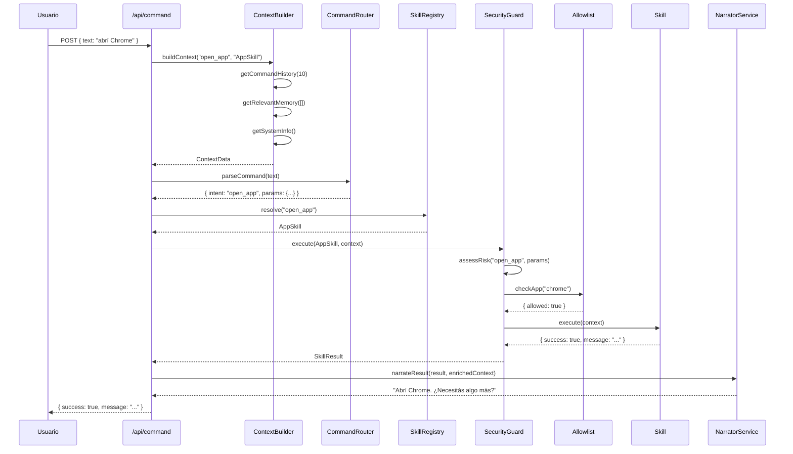

# Documento de Diseño: Mejoras del Asistente

## Introducción

Este documento describe el diseño técnico para tres mejoras clave del asistente de escritorio:

1. **Identidad Neutral**: Eliminar referencias a "Jarvis" y usar una identidad genérica
2. **Sistema de Contexto**: Implementar un Context Builder tipo RAG para enriquecer las solicitudes a la IA
3. **Capa de Seguridad**: Extender el RiskGuard existente con detección mejorada y allowlists

## Visión General

El sistema actual procesa comandos en lenguaje natural a través del endpoint `/api/command`, que parsea el texto, resuelve skills, y ejecuta acciones. Las mejoras se integrarán en este flujo sin romper la arquitectura existente.

### Flujo Actual

```
Usuario → /api/command → CommandRouter → SkillRegistry → RiskGuard → Skill.execute()
                                                              ↓
                                                         AI Services (narración)
```

### Flujo Mejorado

```
Usuario → /api/command → ContextBuilder → CommandRouter → SkillRegistry → SecurityGuard → Skill.execute()
                              ↓                                               ↓
                         (enriquece)                                    (valida + allowlist)
                              ↓                                               ↓
                         AI Services                                    AI Services (narración)
```

## Arquitectura

### Componentes Principales

```mermaid
graph TD
    A[/api/command] --> B[ContextBuilder]
    B --> C[CommandRouter]
    C --> D[SkillRegistry]
    D --> E[SecurityGuard]
    E --> F[Skill.execute]
    
    B --> G[(Command History)]
    B --> H[(Memory System)]
    B --> I[System Info]
    
    E --> J[RiskGuard]
    E --> K[(Allowlist)]
    
    F --> L[NarratorService]
    L --> M[AI Services]
    
    style B fill:#e1f5ff
    style E fill:#ffe1e1
    style M fill:#f0f0f0
```

### Ubicación de Módulos

- **ContextBuilder**: `src/core/context/ContextBuilder.ts` (nuevo)
- **SecurityGuard**: `src/core/security/SecurityGuard.ts` (nuevo)
- **Allowlist**: `src/core/security/Allowlist.ts` (nuevo)
- **Modificaciones**: 
  - `src/ai/claude_ai.ts` (identidad)
  - `src/skills/utils/NarratorService.ts` (identidad)
  - `src/skills/utils/FreeFormHandler.ts` (identidad)
  - `server/index.ts` (integración)

## Componentes e Interfaces

### 1. ContextBuilder

**Responsabilidad**: Construir contexto enriquecido antes de enviar solicitudes a la IA.

**Ubicación**: `src/core/context/ContextBuilder.ts`

#### Interfaces

```typescript
export interface ContextData {
  timestamp: string;
  systemInfo: SystemInfo;
  commandHistory: CommandHistoryEntry[];
  memoryEntries: MemoryEntry[];
  currentIntent: string;
  activeSkill: string | null;
}

export interface SystemInfo {
  os: string;
  platform: string;
  arch: string;
  nodeVersion: string;
}

export interface MemoryEntry {
  key: string;
  value: any;
  timestamp?: string;
}

export interface ContextBuilderOptions {
  maxHistoryEntries?: number;  // default: 10
  maxContextSize?: number;      // default: 8000 chars
  includeSystemInfo?: boolean;  // default: true
}
```

#### Métodos Principales

```typescript
export class ContextBuilder {
  constructor(options?: ContextBuilderOptions);
  
  // Construir contexto completo
  async buildContext(intent: string, skill?: string): Promise<ContextData>;
  
  // Recuperar historial de comandos
  async getCommandHistory(limit: number): Promise<CommandHistoryEntry[]>;
  
  // Recuperar entradas de memoria relevantes
  async getRelevantMemory(keywords: string[]): Promise<MemoryEntry[]>;
  
  // Obtener información del sistema
  getSystemInfo(): SystemInfo;
  
  // Serializar contexto para IA
  serializeForAI(context: ContextData): string;
  
  // Pretty printer para debugging
  prettyPrint(context: ContextData): string;
  
  // Validar tamaño del contexto
  private validateSize(context: ContextData): void;
}
```

#### Integración en server/index.ts

```typescript
// En /api/command, antes de llamar a AI services:

const contextBuilder = new ContextBuilder({
  maxHistoryEntries: 10,
  maxContextSize: 8000
});

// Construir contexto
const enrichedContext = await contextBuilder.buildContext(
  context.intent,
  skill?.name
);

// Usar en llamadas a IA (FreeFormHandler, NarratorService)
const aiPrompt = `${contextBuilder.serializeForAI(enrichedContext)}\n\n${userMessage}`;
```

### 2. SecurityGuard

**Responsabilidad**: Detectar acciones riesgosas, clasificar por nivel de riesgo, y gestionar allowlists.

**Ubicación**: `src/core/security/SecurityGuard.ts`

#### Interfaces

```typescript
export type RiskLevel = 'LOW' | 'MEDIUM' | 'HIGH';

export interface RiskAssessment {
  level: RiskLevel;
  reason: string;
  requiresConfirmation: boolean;
  allowlistBypass: boolean;
}

export interface SecurityGuardOptions {
  allowlist?: Allowlist;
  enableLogging?: boolean;
}
```

#### Métodos Principales

```typescript
export class SecurityGuard {
  constructor(
    private riskGuard: RiskGuard,
    options?: SecurityGuardOptions
  );
  
  // Evaluar riesgo de una acción
  assessRisk(
    intent: string,
    params: Record<string, unknown>
  ): RiskAssessment;
  
  // Ejecutar skill con validación de seguridad
  async execute(
    skill: Skill,
    context: SkillContext
  ): Promise<SkillResult>;
  
  // Verificar si un item está en allowlist
  isAllowlisted(
    type: 'app' | 'path',
    value: string
  ): boolean;
  
  // Registrar confirmación de acción de alto riesgo
  private logConfirmation(
    intent: string,
    params: Record<string, unknown>
  ): void;
}
```

#### Detección de Riesgo

```typescript
// Reglas de clasificación de riesgo
const RISK_RULES = {
  HIGH: [
    'system_shutdown',
    'system_restart',
    'file_delete',
    'excel_delete_row',
    'text_delete'
  ],
  MEDIUM: [
    'open_app',      // apps desconocidas
    'file_create',
    'excel_write',
    'text_replace'
  ],
  LOW: [
    'open_file',
    'read_file',
    'search_files',
    'excel_read',
    'show_help'
  ]
};
```

### 3. Allowlist

**Responsabilidad**: Gestionar listas de aplicaciones y rutas aprobadas.

**Ubicación**: `src/core/security/Allowlist.ts`

#### Interfaces

```typescript
export interface AllowlistConfig {
  apps: string[];
  paths: string[];
}

export interface AllowlistResult {
  allowed: boolean;
  matchedEntry?: string;
}
```

#### Métodos Principales

```typescript
export class Allowlist {
  constructor(config?: AllowlistConfig);
  
  // Verificar si una app está permitida
  checkApp(appName: string): AllowlistResult;
  
  // Verificar si una ruta está permitida
  checkPath(filePath: string): AllowlistResult;
  
  // Agregar entrada a allowlist
  add(type: 'app' | 'path', value: string): void;
  
  // Remover entrada de allowlist
  remove(type: 'app' | 'path', value: string): void;
  
  // Cargar allowlist desde archivo
  static async loadFromFile(path: string): Promise<Allowlist>;
  
  // Guardar allowlist a archivo
  async saveToFile(path: string): Promise<void>;
  
  // Matching case-insensitive
  private normalizeForMatch(value: string): string;
}
```

#### Configuración por Defecto

```typescript
// config/allowlist.json
{
  "apps": [
    "chrome",
    "notepad",
    "calculator",
    "vscode",
    "excel"
  ],
  "paths": [
    "C:\\Users\\*\\Desktop\\*",
    "C:\\Users\\*\\Documents\\*"
  ]
}
```

### 4. Cambios de Identidad

#### claude_ai.ts

```typescript
// ANTES:
const system = `Sos Jarvis, un asistente de escritorio inteligente...`;

// DESPUÉS:
const system = `Soy tu asistente virtual, un asistente de escritorio inteligente...`;
```

#### NarratorService.ts

```typescript
// ANTES:
const prompt = `En una oración natural en español, como Jarvis, describí esta acción:`;

// DESPUÉS:
const prompt = `En una oración natural en español, describí esta acción:`;
```

#### FreeFormHandler.ts

```typescript
// ANTES:
const ollamaPrompt = `Sos un asistente de escritorio inteligente llamado Jarvis.`;

// DESPUÉS:
const ollamaPrompt = `Soy tu asistente virtual, un asistente de escritorio inteligente.`;
```

## Modelos de Datos

### ContextData

```typescript
{
  timestamp: "2024-01-15T10:30:00.000Z",
  systemInfo: {
    os: "Windows_NT",
    platform: "win32",
    arch: "x64",
    nodeVersion: "v18.17.0"
  },
  commandHistory: [
    {
      timestamp: "2024-01-15T10:29:45.000Z",
      command: "abrí Chrome",
      intent: "open_app",
      method: "AppSkill",
      confidence: 0.9,
      executionTime: 1250,
      result: "success"
    }
  ],
  memoryEntries: [
    {
      key: "user_preferences",
      value: { theme: "dark", language: "es" },
      timestamp: "2024-01-15T09:00:00.000Z"
    }
  ],
  currentIntent: "open_file",
  activeSkill: "FileSkill"
}
```

### RiskAssessment

```typescript
{
  level: "HIGH",
  reason: "Shutdown operations are destructive and irreversible",
  requiresConfirmation: true,
  allowlistBypass: false
}
```

### AllowlistConfig

```typescript
{
  apps: ["chrome", "notepad", "calculator"],
  paths: [
    "C:\\Users\\Usuario\\Desktop\\*",
    "C:\\Users\\Usuario\\Documents\\*"
  ]
}
```

## Correctness Properties

*A property is a characteristic or behavior that should hold true across all valid executions of a system-essentially, a formal statement about what the system should do. Properties serve as the bridge between human-readable specifications and machine-verifiable correctness guarantees.*

### Property 1: System prompts use neutral identity

*For any* system prompt string in AI services (claude_ai.ts, NarratorService.ts, FreeFormHandler.ts), the prompt should not contain the string "Jarvis"

**Validates: Requirements 1.2**

### Property 2: Command history retrieval respects limit

*For any* positive integer N, calling ContextBuilder.getCommandHistory(N) should return at most N entries, ordered chronologically (most recent last)

**Validates: Requirements 2.1**

### Property 3: Keyword matching is case-insensitive

*For any* keyword string, searching memory with the keyword in uppercase and lowercase should return the same set of entries

**Validates: Requirements 2.8**

### Property 4: Context serialization produces valid JSON

*For any* valid ContextData object, calling serializeForAI() then JSON.parse() should succeed without throwing an error

**Validates: Requirements 5.4**

### Property 5: Context size is bounded

*For any* ContextData object produced by buildContext(), the serialized string length should not exceed the configured maxContextSize

**Validates: Requirements 2.9**

### Property 6: HIGH risk actions require confirmation

*For any* action classified as HIGH risk, the RiskAssessment should have requiresConfirmation=true (unless allowlist bypass applies)

**Validates: Requirements 3.3**

### Property 7: Allowlisted items bypass confirmation

*For any* item in the allowlist, when SecurityGuard assesses risk for that item, allowlistBypass should be true

**Validates: Requirements 3.7**

### Property 8: Risk classification is valid

*For any* intent and params, SecurityGuard.assessRisk() should return a RiskLevel that is one of 'LOW', 'MEDIUM', or 'HIGH'

**Validates: Requirements 3.2**

### Property 9: Confirmed HIGH risk actions are logged

*For any* HIGH risk action that is confirmed and executed, a log entry should exist with the action details

**Validates: Requirements 3.12**

### Property 10: Context includes timestamp

*For any* ContextData object produced by buildContext(), the object should have a non-empty timestamp field in ISO 8601 format

**Validates: Requirements 5.5**

### Property 11: Command history is chronologically ordered

*For any* command history array returned by ContextBuilder, each entry's timestamp should be less than or equal to the next entry's timestamp

**Validates: Requirements 5.1**

### Property 12: Memory entries are key-value pairs

*For any* memory entries array in ContextData, each entry should have both a 'key' string field and a 'value' field

**Validates: Requirements 5.2**

### Property 13: Context serialization round-trip

*For any* valid ContextData object, serializing then parsing should produce an equivalent object (JSON.parse(JSON.stringify(context)) should deep-equal context)

**Validates: Requirements 5.7**

## Manejo de Errores

### ContextBuilder

- **Historia vacía**: Retornar array vacío, no error
- **Memoria no encontrada**: Retornar array vacío, no error
- **Contexto demasiado grande**: Truncar entradas más antiguas hasta cumplir límite
- **Error de serialización**: Lanzar error con mensaje descriptivo

### SecurityGuard

- **Intent desconocido**: Clasificar como MEDIUM por defecto
- **Allowlist no disponible**: Continuar sin bypass
- **Error en RiskGuard**: Propagar error al caller
- **Confirmación expirada**: Requerir nueva confirmación

### Allowlist

- **Archivo no encontrado**: Crear allowlist vacía
- **JSON inválido**: Lanzar error con detalles
- **Entrada duplicada**: Ignorar silenciosamente
- **Pattern inválido**: Validar y rechazar con error

## Estrategia de Testing

### Enfoque Dual

Este proyecto utilizará tanto **unit tests** como **property-based tests** para lograr cobertura completa:

- **Unit tests**: Casos específicos, ejemplos concretos, edge cases
- **Property tests**: Propiedades universales que deben cumplirse para todos los inputs

### Unit Testing

Los unit tests se enfocarán en:

- Ejemplos específicos de identidad neutral (verificar strings exactos)
- Casos de riesgo conocidos (shutdown = HIGH, read_file = LOW)
- Integración entre componentes (ContextBuilder → AI Services)
- Edge cases (historia vacía, allowlist vacía, contexto máximo)

**Ubicación**: 
- `src/core/context/__tests__/ContextBuilder.test.ts`
- `src/core/security/__tests__/SecurityGuard.test.ts`
- `src/core/security/__tests__/Allowlist.test.ts`

### Property-Based Testing

Los property tests validarán las propiedades universales definidas en la sección de Correctness Properties.

**Configuración**:
- Librería: `fast-check` (para TypeScript/JavaScript)
- Iteraciones mínimas: 100 por test
- Cada test debe referenciar su propiedad del diseño

**Ejemplo de Property Test**:

```typescript
import fc from 'fast-check';

// Feature: assistant-improvements, Property 2: Command history retrieval respects limit
test('getCommandHistory respects limit for any N', () => {
  fc.assert(
    fc.property(
      fc.integer({ min: 1, max: 100 }),
      async (n) => {
        const builder = new ContextBuilder();
        const history = await builder.getCommandHistory(n);
        expect(history.length).toBeLessThanOrEqual(n);
      }
    ),
    { numRuns: 100 }
  );
});

// Feature: assistant-improvements, Property 3: Keyword matching is case-insensitive
test('keyword matching is case-insensitive', () => {
  fc.assert(
    fc.property(
      fc.string({ minLength: 1, maxLength: 20 }),
      async (keyword) => {
        const builder = new ContextBuilder();
        const upperResults = await builder.getRelevantMemory([keyword.toUpperCase()]);
        const lowerResults = await builder.getRelevantMemory([keyword.toLowerCase()]);
        expect(upperResults).toEqual(lowerResults);
      }
    ),
    { numRuns: 100 }
  );
});
```

**Ubicación**:
- `src/core/context/__tests__/ContextBuilder.property.test.ts`
- `src/core/security/__tests__/SecurityGuard.property.test.ts`

### Tests de Integración

Verificar el flujo completo:

1. Request → ContextBuilder → AI Service (con contexto enriquecido)
2. Request → SecurityGuard → Skill (con validación de riesgo)
3. Request → SecurityGuard → Allowlist → Skill (bypass de confirmación)

**Ubicación**: `server/__tests__/integration.test.ts`

### Tests de Regresión

Ejecutar todos los tests existentes para garantizar compatibilidad hacia atrás:

```bash
npm test
```

Todos los tests existentes deben pasar sin modificaciones.

## Flujo de Integración

### Secuencia Completa



### Puntos de Integración en server/index.ts

```typescript
// 1. Inicializar componentes (una vez al arrancar)
const contextBuilder = new ContextBuilder({
  maxHistoryEntries: 10,
  maxContextSize: 8000
});

const allowlist = await Allowlist.loadFromFile('./config/allowlist.json');
const securityGuard = new SecurityGuard(guard, { allowlist });

// 2. En /api/command, construir contexto
const enrichedContext = await contextBuilder.buildContext(
  context.intent,
  skill?.name
);

// 3. Ejecutar con SecurityGuard en lugar de RiskGuard directo
const result = await securityGuard.execute(skill, context);

// 4. Narrar con contexto enriquecido
if (result.success && NARRATION_ENABLED) {
  const narratedMessage = await narrateResult(result, enrichedContext);
  result.message = narratedMessage;
}
```

## Consideraciones de Implementación

### Rendimiento

- **ContextBuilder**: Cachear systemInfo (no cambia durante ejecución)
- **Allowlist**: Usar Set para lookups O(1)
- **SecurityGuard**: Evaluar riesgo antes de ejecutar skill (fail fast)

### Seguridad

- **Allowlist**: Validar patterns para prevenir path traversal
- **SecurityGuard**: Nunca ejecutar HIGH risk sin confirmación explícita
- **Logging**: No loguear datos sensibles (passwords, tokens)

### Mantenibilidad

- **Separación de concerns**: Cada componente tiene una responsabilidad única
- **Interfaces claras**: Tipos TypeScript para todos los contratos
- **Extensibilidad**: Fácil agregar nuevas reglas de riesgo o allowlist entries

### Compatibilidad

- **No breaking changes**: Todos los endpoints existentes siguen funcionando
- **Opt-in**: ContextBuilder y SecurityGuard son opcionales (con defaults sensatos)
- **Fallbacks**: Si ContextBuilder falla, continuar sin contexto enriquecido

## Próximos Pasos

1. Crear estructura de directorios (`src/core/context`, `src/core/security`)
2. Implementar ContextBuilder con tests
3. Implementar Allowlist con tests
4. Implementar SecurityGuard con tests
5. Actualizar identidad en AI services
6. Integrar en server/index.ts
7. Ejecutar tests de regresión
8. Documentar configuración de allowlist

## Referencias

- Requisitos: `.kiro/specs/assistant-improvements/requirements.md`
- RiskGuard existente: `src/skills/RiskGuard.ts`
- CommandRouter: `src/skills/CommandRouter.ts`
- AI Services: `src/ai/claude_ai.ts`, `src/ai/ollama_ai.ts`
