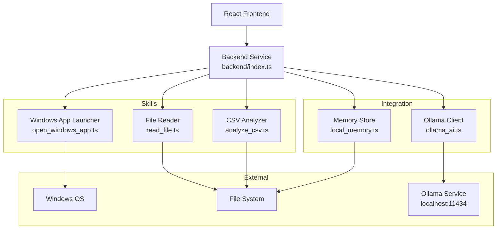

# Design Document: Backend Structure

## Overview

The backend structure provides a modular, skill-based architecture that enables a React frontend application to interact with the Windows operating system, local file system, CSV data, a local Ollama AI service, and persistent JSON-based memory storage. The design emphasizes separation of concerns, type safety, and independent module composition.

The architecture consists of:
- A central backend orchestration module (`backend/index.ts`) that exports all skills
- Individual skill modules for discrete capabilities (Windows app launching, file reading, CSV analysis)
- An AI integration module for Ollama service communication
- A memory persistence module for JSON-based storage

Each module is designed to be independently importable and testable, with no automatic side effects on import. All modules use TypeScript for compile-time type safety and clear interface contracts.

## Architecture

### System Architecture



### Architectural Principles

1. **Modularity**: Each skill is a self-contained module with a single responsibility
2. **No Side Effects**: Modules do not execute code on import; all functionality is explicit function calls
3. **Type Safety**: All modules use TypeScript interfaces and types for compile-time validation
4. **Error Handling**: All modules return structured error information rather than throwing exceptions
5. **Testability**: Each module can be tested independently without requiring the full system

### Module Organization

```
src/
├── backend/
│   └── index.ts          # Central export point for all skills
├── skills/
│   ├── open_windows_app.ts   # Windows application launcher
│   ├── read_file.ts          # File reading capability
│   └── analyze_csv.ts        # CSV parsing and analysis
├── ai/
│   └── ollama_ai.ts      # Ollama AI service integration
└── memory/
    └── local_memory.ts   # JSON-based memory persistence
```

## Components and Interfaces

### Backend Service (backend/index.ts)

The backend service acts as a central orchestration point that re-exports all skill modules. It provides a single import point for the frontend.

**Responsibilities:**
- Export all skill module functions
- Provide a unified interface for frontend consumption
- No business logic (pure re-export module)

**Interface:**
```typescript
// Re-exports from skills
export { openCalculator, openNotepad } from '../skills/open_windows_app';
export { readFile } from '../skills/read_file';
export { analyzeCSV } from '../skills/analyze_csv';
export { generateAIResponse } from '../ai/ollama_ai';
export { saveMemory, loadMemory } from '../memory/local_memory';
```

### Windows App Launcher (skills/open_windows_app.ts)

Provides functions to launch common Windows applications using system commands.

**Responsibilities:**
- Execute Windows shell commands to launch applications
- Handle command execution errors
- Return success/failure status

**Interface:**
```typescript
interface CommandResult {
  success: boolean;
  message: string;
  error?: string;
}

export async function openCalculator(): Promise<CommandResult>;
export async function openNotepad(): Promise<CommandResult>;
```

**Implementation Approach:**
- Use Node.js `child_process.exec()` to execute Windows commands
- For Calculator: execute `calc` command
- For Notepad: execute `notepad` command
- Wrap execution in Promise for async handling
- Capture stdout, stderr, and exit codes
- Return structured result with success flag and message

### File Reader (skills/read_file.ts)

Provides file reading capability with error handling for common failure scenarios.

**Responsibilities:**
- Read text files from the local file system
- Handle file not found errors
- Handle permission errors
- Support UTF-8 encoding

**Interface:**
```typescript
interface FileReadResult {
  success: boolean;
  content?: string;
  error?: string;
  errorType?: 'NOT_FOUND' | 'PERMISSION_DENIED' | 'UNKNOWN';
}

export async function readFile(filePath: string): Promise<FileReadResult>;
```

**Implementation Approach:**
- Use Node.js `fs.promises.readFile()` for async file reading
- Specify UTF-8 encoding explicitly
- Catch and classify errors by error code (ENOENT, EACCES, etc.)
- Return structured result with content or error information

### CSV Analyzer (skills/analyze_csv.ts)

Provides CSV parsing capability using the papaparse library.

**Responsibilities:**
- Parse CSV files with various delimiters
- Handle CSV files with headers
- Return structured data objects
- Handle malformed CSV errors

**Interface:**
```typescript
interface CSVRow {
  [key: string]: string | number;
}

interface CSVAnalysisResult {
  success: boolean;
  data?: CSVRow[];
  headers?: string[];
  rowCount?: number;
  error?: string;
}

export async function analyzeCSV(filePath: string): Promise<CSVAnalysisResult>;
```

**Implementation Approach:**
- First read the file using file system operations
- Use papaparse library to parse CSV content
- Configure papaparse with: header detection, auto-delimiter detection, skip empty lines
- Extract headers from parsed result
- Return structured data with row count and headers
- Handle parsing errors and file reading errors separately

**Dependencies:**
- Requires `papaparse` npm package
- Requires `@types/papaparse` for TypeScript types

### Ollama Client (ai/ollama_ai.ts)

Provides integration with the local Ollama AI service for text generation.

**Responsibilities:**
- Send HTTP POST requests to Ollama API
- Handle streaming responses
- Handle connection failures
- Handle API errors

**Interface:**
```typescript
interface OllamaRequest {
  model: string;
  prompt: string;
  stream?: boolean;
}

interface OllamaResponse {
  success: boolean;
  response?: string;
  error?: string;
  errorType?: 'CONNECTION_FAILED' | 'API_ERROR' | 'UNKNOWN';
}

export async function generateAIResponse(
  prompt: string,
  model?: string
): Promise<OllamaResponse>;
```

**Implementation Approach:**
- Use `fetch()` API to make HTTP POST requests
- Target endpoint: `http://localhost:11434/api/generate`
- Default model: `llama2` (configurable via parameter)
- For streaming responses: read response body as stream and concatenate chunks
- For non-streaming: parse JSON response directly
- Handle network errors (connection refused, timeout)
- Handle HTTP error status codes (4xx, 5xx)
- Return structured result with generated text or error information

**API Request Format:**
```json
{
  "model": "llama2",
  "prompt": "Your prompt here",
  "stream": false
}
```

### Memory Store (memory/local_memory.ts)

Provides JSON-based persistent storage for application memory data.

**Responsibilities:**
- Serialize memory data to JSON
- Write JSON to local file
- Read JSON from local file
- Parse JSON and return as object
- Handle missing files gracefully
- Handle corrupted JSON errors

**Interface:**
```typescript
interface MemoryData {
  [key: string]: any;
}

interface MemorySaveResult {
  success: boolean;
  error?: string;
}

interface MemoryLoadResult {
  success: boolean;
  data?: MemoryData;
  error?: string;
  errorType?: 'NOT_FOUND' | 'PARSE_ERROR' | 'UNKNOWN';
}

export async function saveMemory(data: MemoryData): Promise<MemorySaveResult>;
export async function loadMemory(): Promise<MemoryLoadResult>;
```

**Implementation Approach:**
- Use Node.js `fs.promises.writeFile()` for saving
- Use Node.js `fs.promises.readFile()` for loading
- Default memory file location: `./memory.json` in project root
- For save: use `JSON.stringify()` with 2-space indentation for readability
- For load: use `JSON.parse()` to deserialize
- If file doesn't exist on load, return empty object `{}` with success=true
- If JSON is malformed, return error with PARSE_ERROR type
- Support nested object structures (no depth limit)

## Data Models

### Command Execution Result

Used by Windows App Launcher and any command execution operations.

```typescript
interface CommandResult {
  success: boolean;      // Whether command executed successfully
  message: string;       // Human-readable status message
  error?: string;        // Error details if success=false
}
```

### File Read Result

Used by File Reader module.

```typescript
interface FileReadResult {
  success: boolean;                                    // Whether file was read successfully
  content?: string;                                    // File contents (if success=true)
  error?: string;                                      // Error message (if success=false)
  errorType?: 'NOT_FOUND' | 'PERMISSION_DENIED' | 'UNKNOWN';  // Error classification
}
```

### CSV Analysis Result

Used by CSV Analyzer module.

```typescript
interface CSVRow {
  [key: string]: string | number;  // Dynamic keys based on CSV headers
}

interface CSVAnalysisResult {
  success: boolean;      // Whether CSV was parsed successfully
  data?: CSVRow[];       // Parsed rows as objects
  headers?: string[];    // Column headers
  rowCount?: number;     // Number of data rows
  error?: string;        // Error message if parsing failed
}
```

### Ollama AI Request/Response

Used by Ollama Client module.

```typescript
interface OllamaRequest {
  model: string;         // Model name (e.g., "llama2")
  prompt: string;        // Text prompt for generation
  stream?: boolean;      // Whether to stream response
}

interface OllamaResponse {
  success: boolean;                                           // Whether request succeeded
  response?: string;                                          // Generated text
  error?: string;                                             // Error message
  errorType?: 'CONNECTION_FAILED' | 'API_ERROR' | 'UNKNOWN'; // Error classification
}
```

### Memory Data

Used by Memory Store module.

```typescript
interface MemoryData {
  [key: string]: any;    // Flexible structure for any JSON-serializable data
}

interface MemorySaveResult {
  success: boolean;      // Whether save succeeded
  error?: string;        // Error message if save failed
}

interface MemoryLoadResult {
  success: boolean;                                    // Whether load succeeded
  data?: MemoryData;                                   // Loaded memory data
  error?: string;                                      // Error message
  errorType?: 'NOT_FOUND' | 'PARSE_ERROR' | 'UNKNOWN'; // Error classification
}
```


## Correctness Properties

*A property is a characteristic or behavior that should hold true across all valid executions of a system—essentially, a formal statement about what the system should do. Properties serve as the bridge between human-readable specifications and machine-verifiable correctness guarantees.*

### Property 1: Command Execution Returns Results

*For any* valid Windows command, when executed through the backend service, the system should return a result object containing a success flag and a message.

**Validates: Requirements 1.3**

### Property 2: Failed Commands Return Errors

*For any* Windows command that fails to execute, the system should return a result with success=false and an error message containing failure details.

**Validates: Requirements 1.4**

### Property 3: Application Launch Failures Return Errors

*For any* invalid application name or command that cannot be launched, the Windows App Launcher should return an error result indicating the failure.

**Validates: Requirements 2.5**

### Property 4: File Reading Returns Content

*For any* existing readable file path, the File Reader should successfully read and return the file contents as a string.

**Validates: Requirements 3.1, 3.2**

### Property 5: UTF-8 Files Preserve Content

*For any* text file containing UTF-8 encoded characters (including non-ASCII characters), reading the file should preserve all characters correctly in the returned string.

**Validates: Requirements 3.5**

### Property 6: CSV Parsing Returns Structured Data

*For any* valid CSV file, the CSV Analyzer should return parsed data as an array of structured objects where each object represents a row.

**Validates: Requirements 4.2**

### Property 7: CSV Headers Are Extracted

*For any* CSV file with a header row, the CSV Analyzer should correctly identify and extract the headers, using them as keys in the returned data objects.

**Validates: Requirements 4.3**

### Property 8: Malformed CSV Returns Error

*For any* malformed or invalid CSV content, the CSV Analyzer should return an error result with parsing details rather than returning incorrect data.

**Validates: Requirements 4.4**

### Property 9: Multiple Delimiters Are Supported

*For any* CSV file using comma, semicolon, or tab delimiters, the CSV Analyzer should correctly parse the file and return structured data with the same row count and structure.

**Validates: Requirements 4.5**

### Property 10: Ollama Responses Return Generated Text

*For any* text prompt sent to an available Ollama service, the Ollama Client should return the generated text in the response.

**Validates: Requirements 5.3**

### Property 11: Ollama Errors Are Propagated

*For any* error response from the Ollama service, the Ollama Client should return an error result containing the error details from the service.

**Validates: Requirements 5.5**

### Property 12: Streaming Responses Are Supported

*For any* prompt sent with streaming enabled, the Ollama Client should successfully receive and concatenate all streamed response chunks into a complete response.

**Validates: Requirements 5.6**

### Property 13: Memory Storage Round Trip

*For any* valid JSON-serializable memory data object (including nested structures), saving the data and then loading it should return an equivalent object with the same structure and values.

**Validates: Requirements 6.1, 6.2, 6.3, 6.4, 6.7**

### Property 14: Module Import Has No Side Effects

*For any* backend module, importing the module should not execute any commands, create any files, or make any network requests automatically.

**Validates: Requirements 7.7**


## Error Handling

### Error Handling Strategy

All modules follow a consistent error handling pattern:
1. **No Thrown Exceptions**: Functions return result objects with success flags rather than throwing exceptions
2. **Structured Errors**: Error information includes error messages and error type classifications
3. **Error Propagation**: Errors from underlying systems (file system, network, external services) are caught and wrapped in structured result objects
4. **Graceful Degradation**: Missing resources (like non-existent memory files) return empty/default values rather than errors when appropriate

### Error Categories

**File System Errors:**
- `NOT_FOUND`: File or directory does not exist
- `PERMISSION_DENIED`: Insufficient permissions to read/write file
- `PARSE_ERROR`: File content cannot be parsed (e.g., corrupted JSON)
- `UNKNOWN`: Other file system errors

**Network Errors:**
- `CONNECTION_FAILED`: Cannot connect to service (e.g., Ollama service unavailable)
- `API_ERROR`: Service returned an error response
- `UNKNOWN`: Other network errors

**Command Execution Errors:**
- Command not found
- Command execution timeout
- Command returned non-zero exit code
- Insufficient permissions to execute command

### Module-Specific Error Handling

**Windows App Launcher:**
- Catches `child_process.exec()` errors
- Returns CommandResult with success=false and error message
- Handles command not found, permission denied, and execution failures

**File Reader:**
- Catches file system errors from `fs.promises.readFile()`
- Classifies errors by error code (ENOENT → NOT_FOUND, EACCES → PERMISSION_DENIED)
- Returns FileReadResult with appropriate errorType

**CSV Analyzer:**
- Catches file reading errors (delegates to file system error handling)
- Catches papaparse parsing errors
- Returns CSVAnalysisResult with error message from parser
- Distinguishes between file access errors and parsing errors

**Ollama Client:**
- Catches network errors from `fetch()`
- Handles connection refused (ECONNREFUSED)
- Handles HTTP error status codes (4xx, 5xx)
- Parses error messages from Ollama API responses
- Returns OllamaResponse with appropriate errorType

**Memory Store:**
- For save operations: catches file write errors
- For load operations: returns empty object {} if file doesn't exist (not an error)
- Catches JSON parsing errors and returns PARSE_ERROR type
- Ensures corrupted files don't crash the application

### Error Message Guidelines

Error messages should:
- Be descriptive and actionable
- Include relevant context (file paths, command names, etc.)
- Not expose sensitive information (full system paths in production)
- Be consistent across modules

Example error messages:
- "File not found: /path/to/file.txt"
- "Permission denied reading file: /path/to/file.txt"
- "Failed to parse CSV: unexpected delimiter on line 5"
- "Ollama service unavailable at http://localhost:11434"
- "Failed to parse memory file: invalid JSON syntax"

## Testing Strategy

### Testing Approach

The backend structure will be tested using a dual approach:
1. **Unit Tests**: Verify specific examples, edge cases, and error conditions
2. **Property-Based Tests**: Verify universal properties across many generated inputs

Both testing approaches are complementary and necessary for comprehensive coverage. Unit tests catch specific bugs and validate concrete examples, while property-based tests verify general correctness across a wide range of inputs.

### Property-Based Testing

**Framework:** fast-check (TypeScript/JavaScript property-based testing library)

**Configuration:**
- Minimum 100 iterations per property test (due to randomization)
- Each property test references its design document property
- Tag format: `// Feature: backend-structure, Property {number}: {property_text}`

**Property Test Coverage:**

Each correctness property from the design document will be implemented as a property-based test:

1. **Property 1 (Command Execution Returns Results)**: Generate random valid Windows commands, execute them, verify result structure
2. **Property 2 (Failed Commands Return Errors)**: Generate invalid commands, verify error results with success=false
3. **Property 3 (Application Launch Failures)**: Generate invalid application names, verify error returns
4. **Property 4 (File Reading Returns Content)**: Create temporary files with random content, read them, verify content matches
5. **Property 5 (UTF-8 Files Preserve Content)**: Generate random UTF-8 strings including non-ASCII characters, write to file, read back, verify equality
6. **Property 6 (CSV Parsing Returns Structured Data)**: Generate random valid CSV content, parse it, verify structured array output
7. **Property 7 (CSV Headers Are Extracted)**: Generate CSV with random headers, verify headers are extracted and used as object keys
8. **Property 8 (Malformed CSV Returns Error)**: Generate invalid CSV content, verify error result
9. **Property 9 (Multiple Delimiters Are Supported)**: Generate same data with different delimiters (comma, semicolon, tab), verify equivalent parsed output
10. **Property 10 (Ollama Responses Return Generated Text)**: Send random prompts to Ollama (if available), verify response contains text
11. **Property 11 (Ollama Errors Are Propagated)**: Trigger Ollama errors, verify error details are returned
12. **Property 12 (Streaming Responses Are Supported)**: Send prompts with streaming enabled, verify complete response
13. **Property 13 (Memory Storage Round Trip)**: Generate random JSON-serializable objects (including nested structures), save and load, verify equality
14. **Property 14 (Module Import Has No Side Effects)**: Import modules in isolated environment, verify no file system changes or command executions

### Unit Testing

**Framework:** Vitest (fast unit testing framework for Vite projects)

**Unit Test Focus Areas:**

Unit tests should focus on:
- Specific examples that demonstrate correct behavior
- Edge cases identified in requirements (non-existent files, permission errors, missing Ollama service, corrupted JSON)
- Integration points between modules
- Error message formatting and error type classification

**Specific Unit Tests:**

**Windows App Launcher:**
- Opening Calculator returns success
- Opening Notepad returns success
- Invalid application name returns error with appropriate message

**File Reader:**
- Reading existing file returns content
- Non-existent file returns NOT_FOUND error
- File with restricted permissions returns PERMISSION_DENIED error (requires test setup)
- Empty file returns empty string with success=true

**CSV Analyzer:**
- CSV with headers is parsed correctly
- CSV with comma delimiter is parsed
- CSV with semicolon delimiter is parsed
- CSV with tab delimiter is parsed
- Empty CSV file returns empty array
- Malformed CSV returns error

**Ollama Client:**
- Valid prompt returns generated text (requires Ollama service running)
- Ollama service unavailable returns CONNECTION_FAILED error
- Streaming mode returns complete response

**Memory Store:**
- Save and load simple object succeeds
- Save and load nested object succeeds
- Load non-existent file returns empty object
- Load corrupted JSON returns PARSE_ERROR

**Backend Service:**
- All skill functions are exported
- Importing backend module has no side effects

### Test Environment Setup

**Dependencies:**
```json
{
  "devDependencies": {
    "vitest": "^1.0.0",
    "fast-check": "^3.0.0",
    "@types/node": "^20.0.0"
  }
}
```

**Test File Organization:**
```
src/
├── backend/
│   ├── index.ts
│   └── __tests__/
│       ├── index.test.ts
│       └── index.property.test.ts
├── skills/
│   ├── open_windows_app.ts
│   ├── read_file.ts
│   ├── analyze_csv.ts
│   └── __tests__/
│       ├── open_windows_app.test.ts
│       ├── open_windows_app.property.test.ts
│       ├── read_file.test.ts
│       ├── read_file.property.test.ts
│       ├── analyze_csv.test.ts
│       └── analyze_csv.property.test.ts
├── ai/
│   ├── ollama_ai.ts
│   └── __tests__/
│       ├── ollama_ai.test.ts
│       └── ollama_ai.property.test.ts
└── memory/
    ├── local_memory.ts
    └── __tests__/
        ├── local_memory.test.ts
        └── local_memory.property.test.ts
```

### Test Execution

**Running Tests:**
```bash
# Run all tests
npm test

# Run unit tests only
npm test -- --grep "^(?!.*property)"

# Run property tests only
npm test -- --grep "property"

# Run tests for specific module
npm test -- skills/read_file
```

### Mocking and Test Isolation

**File System Operations:**
- Use temporary directories for file operations in tests
- Clean up test files after each test
- Use in-memory file system for faster tests (optional)

**Command Execution:**
- Mock `child_process.exec()` for unit tests that don't need real command execution
- Use real commands for integration tests
- Be cautious with commands that have side effects

**Network Requests:**
- Mock Ollama API responses for unit tests
- Use real Ollama service for integration tests (mark as optional if service not available)
- Test connection failure scenarios with mocked network errors

**Test Data:**
- Generate random test data using fast-check arbitraries
- Use fixtures for specific edge cases
- Ensure test data is realistic and representative

### Coverage Goals

- **Line Coverage**: Minimum 80%
- **Branch Coverage**: Minimum 75%
- **Function Coverage**: 100% (all exported functions must be tested)
- **Property Coverage**: 100% (all correctness properties must have property-based tests)

### Continuous Integration

Tests should run:
- On every commit (pre-commit hook)
- On every pull request
- Before deployment
- Nightly with extended property test iterations (1000+ iterations)

